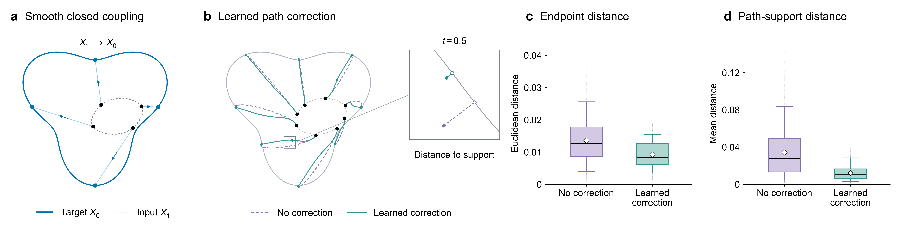
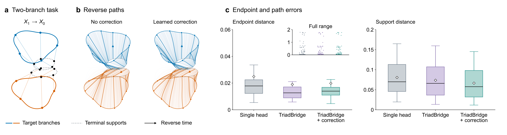

# ManiSB

流形感知条件扩散桥的代码、数据和数值案例。

[实验案例](#实验案例) · [快速开始](#快速开始) · [使用说明](docs/experiments.md) · [English](README.md)

## 研究内容

成对数据的几何结构如何影响扩散桥？什么样的训练目标能让模型学到这些结构？
ManiSB 围绕这两个问题，将桥预测分为三个部分：

- **法向收缩**：把带噪状态拉向当前时刻的桥流形。
- **端点输运**：从流形上的投影点移动到它所对应的端点。
- **后验修正**：补偿解码端点与条件端点均值之间的差异。条件端点均值指给定当前信息后，所有可能端点按其概率加权得到的平均位置。

论文在平滑端点耦合下，分析桥过程中的几何结构、不同监督方式确定的分量，以及加入投影校正后的采样稳定性。
两个数值案例展示学习式几何校正如何改变终点恢复误差和端点之间的路径。

## 实验案例

### 平滑闭合耦合

同一个隐变量角度将三瓣目标曲线与压缩、旋转后的终止曲线配对。
实验比较同一个三头模型在几何校正前后的采样结果，观察终点误差以及路径到各时刻桥支撑的距离。

[](figures/paper/fig_smooth_closed_coupling.pdf)

[数据](data/case1_smooth_closed/) · [代码](code/case1_smooth_closed/) · [配置](configs/case1_swirl.json)

### 带曲率的多分支耦合

双分支端点耦合产生不同的输运路径。实验在相同的 4,096 对端点上，比较单头模型、三头模型和加入学习式几何校正的三头模型。

[](figures/paper/fig3_multibranch_linear_v5.pdf)

[数据](data/case2_curved_multibranch/) · [代码](code/case2_curved_multibranch/) · [结果](results/case2_curved_multibranch/metrics_summary.json)

模型规模、训练设置、指标含义和结果表见[实验说明](docs/experiments.md)。

## 快速开始

记录的运行环境为 Python 3.12.2 和 PyTorch 2.6.0。创建环境并安装依赖：

```bash
git clone https://github.com/BrianZhu1999/ManiSB.git
cd ManiSB
python -m venv .venv
source .venv/bin/activate
python -m pip install -r requirements.txt
```

Windows PowerShell 使用 `.\.venv\Scripts\Activate.ps1` 激活环境。
使用 GPU 训练时，安装与 CUDA 驱动兼容的 PyTorch 版本。

检查随仓库提供的数据和图文件：

```bash
python code/verify_project.py --root .
python code/case1_smooth_closed/verify_exports.py --root .
python code/case2_curved_multibranch/verify_case2_package.py --root .
```

这些检查可在 CPU 上运行。训练命令和输出位置见[使用说明](docs/experiments.md#training)。

## 数据与代码

两个案例均采用合成端点耦合。仓库提供端点对、采样轨迹、解析支撑上的采样点、逐样本指标和上方展示的实验图。

| 目录 | 内容 |
| --- | --- |
| [code/](code/) | 模型、训练、采样、导出和检查代码 |
| [configs/](configs/) | 模型与评估设置 |
| [data/](data/) | 轨迹数组与逐样本指标 |
| [results/](results/) | 指标汇总与检查记录 |
| [figures/](figures/) | PNG、SVG、PDF 和 TIFF 格式的图 |
| [provenance/](provenance/) | 环境记录、源代码与数据哈希 |

## 许可证

源代码采用 [MIT 许可证](LICENSE)。
